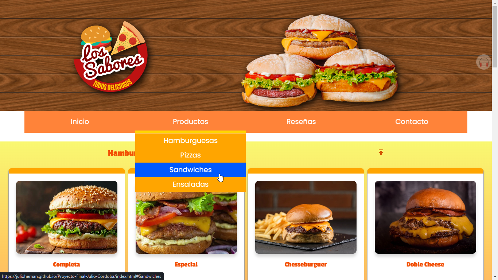

# Los Sabores - Sitio web de comidas rápidas

## Descripción
"Los Sabores" es un sitio web de comidas rápidas que ofrece una variedad de deliciosas opciones a los clientes. El objetivo del sitio es proporcionar una experiencia de usuario agradable y facilitar el proceso de pedido y contacto con la empresa.

## Características principales
1. **Página de Inicio (index.html)**: Muestra una sección de productos utilizando CSS Flexbox, donde los usuarios pueden ver las diferentes opciones de comidas rápidas disponibles.
2. **Página de Contacto (contacto.html)**: Incluye un formulario de contacto que permite a los usuarios enviar sus consultas o comentarios, y también muestra la ubicación de la empresa.
3. **Página de Reseñas (resenias.html)**: Presenta las reseñas de los clientes en una sección organizada utilizando CSS Grid.

## Tecnologías utilizadas
- HTML5
- CSS3 (Flexbox y Grid)
- JavaScript

## Estructura del proyecto
- La carpeta `css` contiene los archivos CSS necesarios para el diseño del sitio web.
- La carpeta `img` almacena las imágenes utilizadas en el proyecto.
- La carpeta `js` contiene los archivos JavaScript.

## Cómo ejecutar el proyecto
1. Clona o descarga el repositorio en tu máquina local.
2. Abre el archivo `index.html` en tu navegador web.

¡Disfruta explorando "Los Sabores", nuestro sitio web de comidas rápidas!